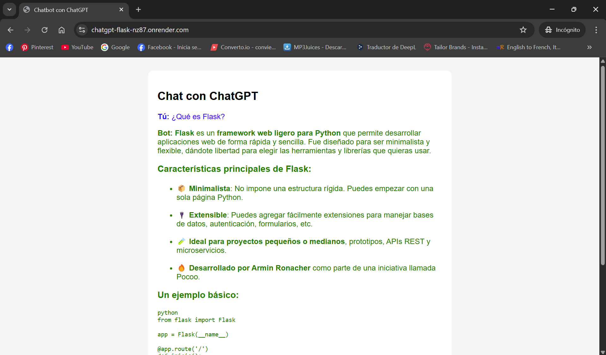

# 🤖 Chatbot con Flask + OpenAI (ChatGPT API) 
 
Este proyecto es una aplicación web construida con **Flask** que actúa como un chatbot utilizando la **API de OpenAI (ChatGPT)**. Ideal para aprender cómo integrar un modelo de lenguaje a una app Python sencilla. 
 
## 🚀 Demo en vivo 
 
Puedes ver una versión desplegada en Render aquí, pero **ya no está funcionando por falta de tokens**.   
👉 [chatgpt-flask-nz87.onrender.com](https://chatgpt-flask-nz87.onrender.com) 
 
Si deseas probarlo por tu cuenta, puedes generar tu propia clave desde la [plataforma de OpenAI](https://platform.openai.com/account/api-keys) y añadirla como variable de entorno `OPENAI_API_KEY`. 
 
## ⚠️ Posible error de tokens 
 
Si ejecutas la aplicación sin una cuenta válida o sin saldo disponible, es probable que encuentres un error como este:

```
**Bot:** Error: Error code: 429 - {'error': {'message': 'You exceeded your current quota, please check your plan and billing details. For more information on this error, read the docs: https://platform.openai.com/docs/guides/error-codes/api-errors.', 'type': 'insufficient_quota', 'param': None, 'code': 'insufficient_quota'}}
```

Este error indica que has agotado tu cuota actual de tokens. Debes:
- Verificar tu plan en OpenAI
- Revisar tus detalles de facturación
- Añadir crédito a tu cuenta
 
## 📂 Estructura del proyecto 
 
``` 
chatgpt-flask/
├── app.py               # Lógica principal del servidor Flask
├── requirements.txt     # Dependencias del proyecto
├── runtime.txt          # Versión de Python para Render
├── Procfile             # Comando para producción
├── README.md            # Documentación del proyecto
├── img/
│   └── chatgpt-flask.png  # Captura del chatbot funcionando
├── templates/
│   └── index.html       # Interfaz web del chatbot
``` 
 
## ⚙️ Requisitos 
 
- Python 3.8 o superior 
- Una clave de API de OpenAI 
 
## 🛠️ Instalación local 
 
1. **Clona el repositorio:** 
 
```bash 
git clone https://github.com/joaquinjordann/chatgpt-flask.git 
cd chatgpt-flask 
``` 
 
2. **Crea un entorno virtual (opcional pero recomendado):** 
 
```bash 
python -m venv venv 
source venv/bin/activate   # En Windows: venv\Scripts\activate 
``` 
 
3. **Instala las dependencias:** 
 
```bash 
pip install -r requirements.txt 
``` 
 
4. **Crea un archivo `.env` con tu clave de OpenAI:** 
 
```env 
OPENAI_API_KEY=sk-xxxxx... 
``` 
 
5. **Ejecuta la app:** 
 
```bash 
python app.py 
``` 
 
Visita http://localhost:5000 para probar tu chatbot localmente. 
 
## 🧪 Tecnologías usadas 
 
* Flask 
* OpenAI Python SDK 
* HTML/CSS básico 
 
## 💡 Nota importante 
 
Este proyecto requiere una clave válida de OpenAI con crédito disponible para funcionar correctamente. Puedes obtenerla desde platform.openai.com/account/api-keys y revisar tu plan de uso en la sección de **Billing**. 
 
## 📸 Captura del proyecto funcionando 
 

 
## 🧠 Autor 
 
Desarrollado por Joaquín Jordán 
 
## 📝 Licencia 
 
MIT License